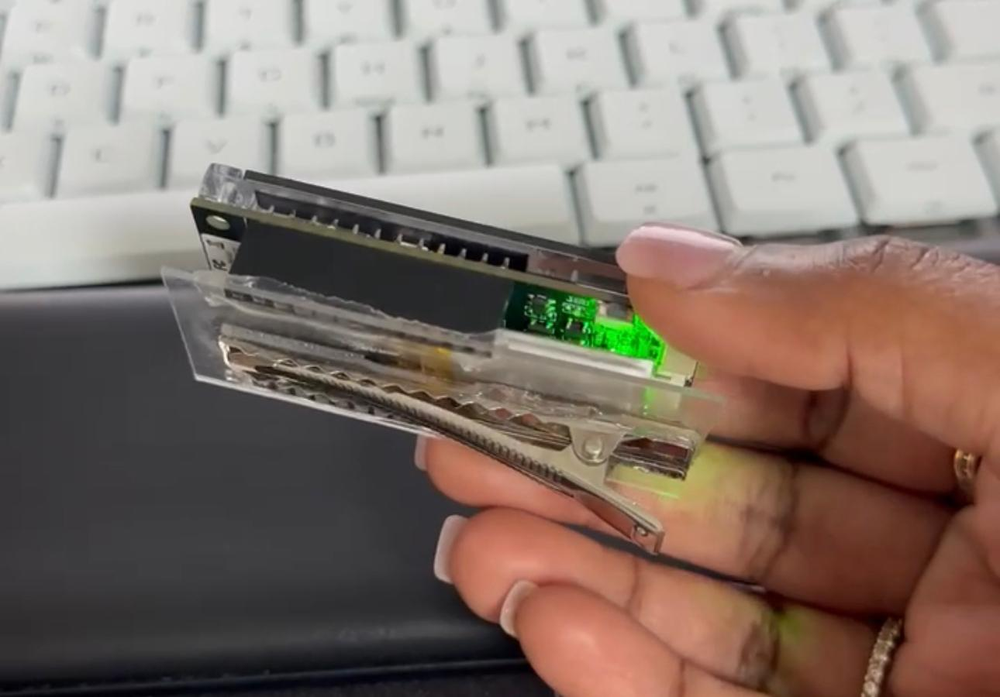
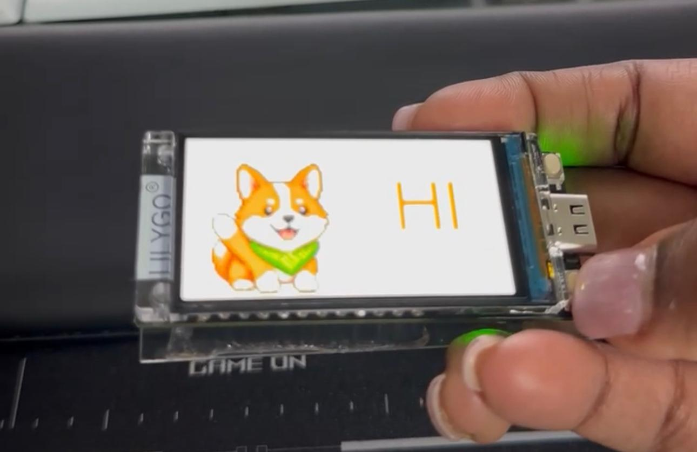
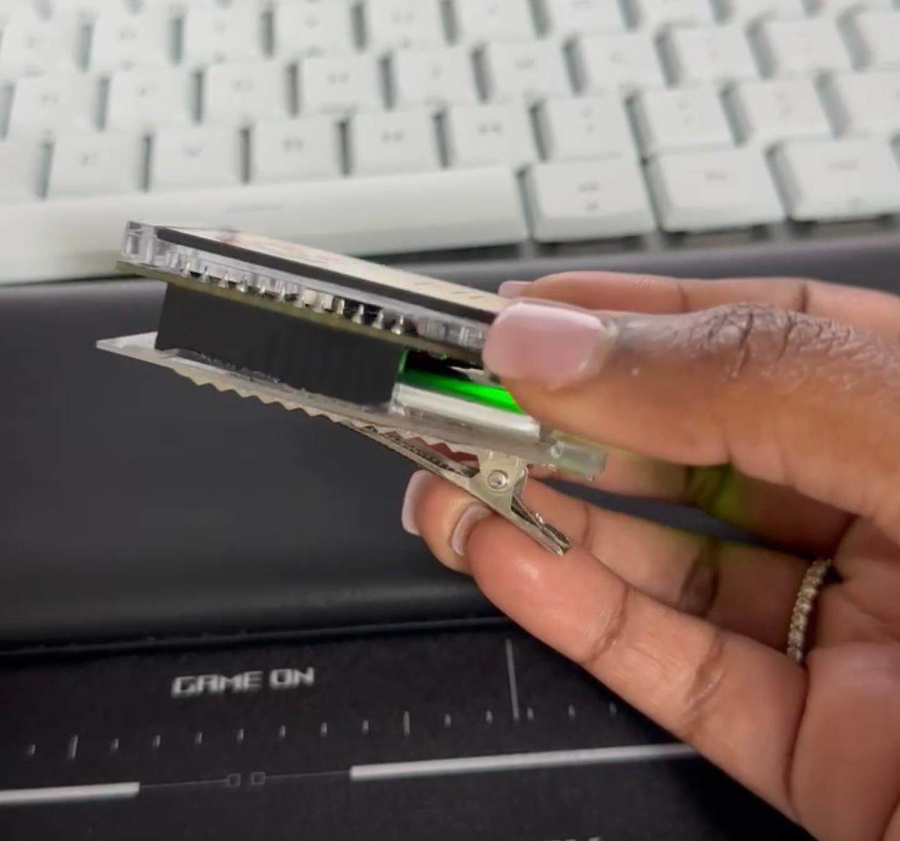
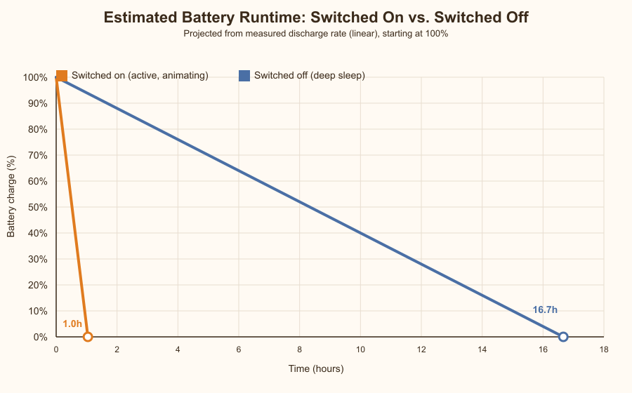

# The Digital Hair Clip

A LilyGo T-Display S3 turned into a wearable, battery-powered hair clip that
cycles through a little corgi's daily moods. It started as a "can I put a
tiny animated screen on a hair clip" idea, and turned into a small project
in embedded power budgeting: every design decision here — the sprite art,
the frame rate, the brightness, the sleep behaviour — exists because a
220mAh battery is a genuinely tiny amount of energy, and a full-colour LCD
is a genuinely hungry thing to run off it.

This document is both the story of how it got built and the reference for
building your own.

## What it actually does

Five slides, cycled with a button press, each with its own little looping
corgi animation and its own colour:

1. **HI!** — a big wave, warm orange text
2. **REDBULL UNTIL FRIYAY** — the corgi jumping for joy
3. **SMILE! IT'S FRIYAY!** — a happy blinking loop
4. **1% BATTERY, 100% MAIN CHARACTER ENERGY** — a confident running loop
5. **ERROR 404: BAD VIBES NOT FOUND** — the corgi thinking it over, unconvinced

Every slide shows a live battery percentage in the top-right corner, read
straight off the board's onboard GPIO4 voltage divider — green at 20% or
above, red below.

### Controls

| Button | Function |
|---|---|
| **BOOT** (GPIO0) | Advance to the next slide (wraps around after slide 5) |
| **USER** (GPIO14) | Power button — press to sleep (screen goes black, board enters deep sleep), press again to wake up |

Waking from sleep always restarts from slide 1, since deep sleep doesn't
preserve RAM. There's no true hardware power-off on this board without
extra circuitry, so deep sleep is the closest practical equivalent to
"off." How much that actually saves is covered honestly, with real
numbers, further down — the short version is: less than you'd hope.

---

## Building one

### What you need

- **LilyGo T-Display S3** (1.9" ST7789 LCD, ESP32-S3), in its normal black
  housing
- **A 3.7V 220mAh LiPo battery**, the small 402030-size cell with a
  2-pin JST connector and a built-in protection circuit (the kind sold for
  small DIY electronics — it'll usually have a tiny status LED on the
  board itself)
- **A small screwdriver set** — you'll need it to open the board's case
- **Electronics-safe double-sided sticky tape** (a foam mounting tape
  works well; you want something that won't leave residue or short
  anything out)
- **A sheet of acrylic, 2-3mm thick** — this becomes the rigid backing
  the whole thing is built on
- **An alligator clip** (the metal spring-loaded kind, like a large
  bulldog/crocodile clip) — this is what actually grips your hair

### ⚠️ Safety first — read this before touching the battery

The T-Display S3 has its **battery pins exposed on the side edge of the
board**, right where they're soldered to the JST connector. There's no
cover over them by default. This matters for two separate reasons:

- **The two exposed pins must never touch each other, or touch anything
  conductive that bridges them** — a stray strand of hair, a bit of metal
  dust, a loose wire, anything. Bridging positive and negative directly
  shorts the battery through its thinnest, least protected path, which
  can rapidly overheat the cell, damage the board, or in the worst case
  cause the battery to vent or catch fire. Since this whole project is
  designed to sit *in your hair*, this isn't a theoretical risk — **cover
  the exposed pins with a small piece of insulating tape or a printed/cut
  plastic shroud before wearing it**, so nothing can bridge them by
  accident.
- **Battery polarity must be correct every single time you connect it.**
  Getting the JST connector backwards — positive into the pin expecting
  negative, or vice versa — can genuinely destroy the board, the battery,
  or both. This isn't a "it just won't turn on" failure mode; reversed
  polarity can push current somewhere the circuit was never designed to
  handle, with real potential for heat, damage, or a swelling/venting
  battery. Most JST connectors are keyed so they physically can't be
  plugged in backwards, but don't rely on that alone — **check red-to-red,
  black-to-black before every connection**, especially if you ever
  disconnect and reconnect the battery later.

None of this means don't build it — it means build it with those two
things specifically in mind, and don't skip the insulation step.

### Step by step

1. **Flash the firmware first, while everything is still easy to reach.**
   Connect the bare board to your PC over USB-C and go through the
   [installation steps](#installation) below in Arduino IDE. It's much
   easier to debug upload issues, iterate on colours/animations, and test
   button behaviour *before* everything is glued into a fixed physical
   assembly. (This is also where an AI coding assistant genuinely earns
   its keep — most of the real engineering here was compiling, flashing,
   diagnosing a corrupted-sprite bug, and tuning frame timing over dozens
   of iterations, which is a lot less painful with something driving the
   toolchain for you.)

2. **Open the case.** Use the small screwdriver set to carefully take the
   board out of its plastic housing. You just need the bare PCB — the
   housing isn't used in the final assembly.

3. **Connect the battery — carefully.** Check polarity (red-to-red,
   black-to-black) before you seat the connector — see the safety note
   above for why this matters. Once it's connected, **cover the exposed
   battery pins on the side of the board with a small piece of insulating
   tape or a thin plastic shroud**, so nothing (hair included) can bridge
   them once this is being worn.

4. **Cut the acrylic sheet to size.** Trace the bare board's outline (or
   just eyeball it slightly larger) onto the acrylic and cut it down —
   this becomes the rigid plate that everything else mounts to. Acrylic
   is chosen here specifically because it's rigid, thin, and light: a
   hair clip needs to not flex when clipped in, but also can't add much
   weight.

5. **This is the part that actually makes it a "clip": mount the
   alligator clip to the acrylic.** Use the electronics-safe sticky tape
   to fix the alligator clip's flat handle/base to the back of the
   acrylic sheet, with its spring-loaded jaws facing outward past one
   edge. The alligator clip is doing the actual mechanical job a hair
   clip needs to do — clamping onto a section of hair and holding its
   own weight — while the acrylic gives it a flat, rigid surface to be
   mounted to instead of trying to stick electronics directly onto a
   springy metal clip.

6. **Stick the board to the front of the acrylic**, on the opposite face
   from the clip, using the same sticky tape. Keep the battery tucked
   against the acrylic too, ideally with its own small strip of tape so
   it isn't just dangling on its wires.

7. **Check clearances.** Make sure the alligator clip's jaws can still
   open and close freely without catching on the board or battery wires,
   and that the USB-C port is still reachable for future re-flashing
   without having to pull anything apart.

That's it — clip it into a section of hair, press BOOT to cycle slides,
and press the power button when you're done wearing it.

### The finished build

<p align="center">
  
  
  
</p>

<p align="center">
  <video src="docs/photos/device_demo.mp4" controls width="480">
    Your browser doesn't support inline video — <a href="docs/photos/device_demo.mp4">download the clip</a> instead.
  </video>
</p>

---

## The software side, and why the animation choice matters so much

The firmware is a single Arduino sketch (`dog_slides/dog_slides.ino`)
using `TFT_eSPI` for display output, with each slide's corgi animation
stored as a small array of raw 16-bit colour frames compiled directly
into the firmware (no SD card, no filesystem — everything lives in flash).

### Where the art came from

The corgi spritesheet used for the "jump" and "thinking" animations was
downloaded from a free asset website (a pre-made pixel-art corgi
character sheet, distributed as a single packed image plus a small JSON
manifest describing it) — the exact site isn't recorded, so treat the art
as unattributed. Rather than hand-drawing dozens of animation
frames, the sheet was sliced programmatically — detecting each sprite's
bounding box against its transparent background, cropping it out, flattening
it onto the same cream background colour the UI uses, and converting each
frame's pixels into the raw 16-bit colour format the display expects.
That pipeline is what let five completely different mood animations
(waving, jumping, thinking-it-over, etc.) get swapped in and compared
quickly, instead of being stuck with whatever came bundled originally.
The original spritesheet itself is kept in `docs/assets/` for reference,
not shown here.

### Why the animation is the main battery lever

This is the part that isn't obvious until you've actually measured it:
**redrawing the screen is the single most expensive thing this firmware
does, by a wide margin.** Every animation frame means pushing thousands of
pixels over SPI to the display controller, and SPI transfers cost real,
measurable current — noticeably more than the CPU idling or even the
backlight LED at moderate brightness. Which means the animation *frame
rate* is a direct, physical battery-life dial:

- A slide with a fast 6fps loop redraws the screen roughly twice as often
  as one running at 3fps, for roughly twice the SPI/display power cost,
  for a visual difference most people barely register.
- Frame delays across every slide were deliberately tuned upward (slower)
  from their original values, and two slides that still felt like they
  needed motion (the jump and battery slides) were tuned back down
  individually, rather than leaving everything fast by default.
- The dog animation buffer itself is also kept as small as the art
  allows (a 130x130 or 160x160 pixel sprite, not the full 320x170
  screen), so each redraw only touches a fraction of the display.

In short: the character of the animation (how bouncy, how fast, how
often it updates) was chosen as a battery-life decision first and a
"does it look nice" decision second — and it mattered more than almost
anything else in the firmware.

### Everything else that was tuned for battery life

- **Backlight dimmed to ~35% brightness** (`BRIGHTNESS_LEVEL = 90` out of
  255) via hardware PWM — the backlight LED is normally one of the two
  biggest power draws on a display like this, right alongside the SPI
  redraw cost above, so this alone made a big difference.
- **CPU clocked down to 80MHz** (`setCpuFrequencyMhz(80)`) instead of the
  chip's full 240MHz — this firmware isn't doing anything performance-
  sensitive, so there's no reason to run the CPU any faster than it
  needs to draw a few sprites and poll two buttons.
- **Wi-Fi and Bluetooth radios explicitly powered down** at boot
  (`esp_wifi_stop()`, `esp_bt_controller_disable()`) — neither is used
  anywhere in this project, but the ESP32-S3 can leave them in a
  partially-powered state by default, silently drawing current for
  nothing.
- **Automatic CPU light sleep enabled** (`esp_pm_configure(...)`) so the
  chip drops into a low-power state during every idle gap between frames
  and button polls, instead of spinning at full clock waiting for the
  next `delay()` to expire. This has no effect on animation smoothness or
  button responsiveness — light-sleep wake latency is sub-millisecond,
  far faster than anything this firmware needs to react to.

---

## Battery performance: on vs. deep sleep

Here's where it gets honest. A real timed test was run on the physical
device — checking the on-screen battery percentage at specific clock
times, some stretches with the screen actively on and animating, some
stretches with the board put into deep sleep via the power button.
Two consistent rates came out of that: roughly **16% drained per 10
minutes while switched on and animating**, versus roughly **9% drained
per 1.5 hours in deep sleep**. Projected out as a full runtime from
100% to 0%, that's a stark difference:



### What this actually shows

Switched on and left animating continuously, this 220mAh cell is gone in
about **an hour**. Put to sleep with the power button between wears, the
same battery stretches to roughly **16-17 hours**. That's not a subtle
difference — it means the power button isn't a nice-to-have here, it's
the entire reason this thing is wearable for more than a single outing.

The reason the gap is this large comes back to the point made earlier:
**redrawing the screen is the most expensive thing this firmware does.**
Every animation frame is a fresh SPI transfer of thousands of pixels to
the display, on top of the backlight LED staying lit the whole time — and
that cost is being paid roughly 5-10 times a second, continuously,
whenever a slide is left animating on screen. Deep sleep removes all of
that at once: no backlight, no CPU pushing frames, no SPI traffic, just
the ESP32 sitting in its lowest-power state waiting for the power button.

**Practical takeaway:** treat the power button as essential, not optional.
Left running continuously, expect well under two hours of wear before
it's flat. Put to sleep whenever it's not actively being looked at,
expect closer to a full day's worth of standby.

---

## Installation

1. **Install Arduino IDE** (2.x) from [arduino.cc](https://www.arduino.cc/en/software).
2. **Add the ESP32 board package**: File -> Preferences -> paste this into "Additional boards manager URLs":
   ```
   https://raw.githubusercontent.com/espressif/arduino-esp32/gh-pages/package_esp32_index.json
   ```
   Then Tools -> Board -> Boards Manager -> search "esp32" -> install the Espressif package.
3. **Install the display library**: download [LilyGo's T-Display-S3 repo](https://github.com/Xinyuan-LilyGO/T-Display-S3), and copy everything inside its `lib/` folder into your Arduino `libraries/` folder (e.g. `Documents/Arduino/libraries`). This bundle includes a pre-configured `TFT_eSPI` with this board's correct pin mapping -- don't let the IDE auto-update it later, or it'll overwrite that config.
4. **Clone this repo** (or download it as a ZIP and extract it), keeping the `dog_slides` folder intact -- Arduino needs the `.ino` file and its `.h` sprite files together in one folder.
5. **Open `dog_slides/dog_slides.ino`** in Arduino IDE.
6. **Set the board options** under Tools:
   - Board: `LilyGo T3-S3` (or `ESP32S3 Dev Module` if that specific entry isn't available)
   - USB CDC On Boot: `Enabled`
   - Flash Size: `16MB`
   - PSRAM: `OPI PSRAM`
   - Partition Scheme: `16M Flash (3MB APP/9.9MB FATFS)`
   - Upload Mode: `UART0/Hardware CDC`
   - USB Mode: `CDC and JTAG`
7. **Connect the board** via USB-C (a cable with data lines, not a charge-only one), select its port under Tools -> Port, and click **Upload**.

If the upload hangs on "Connecting...." with no response, hold the
**BOOT** button, tap **RESET** once while still holding BOOT, then start
the upload and release BOOT once it starts writing — this manually forces
the chip into its bootloader instead of relying on the auto-reset circuit.

The board will boot straight into slide 1 once flashing finishes.

## Uninstallation

There's no separate "uninstaller" -- removing this project just means putting different firmware on the board, or removing the code from your machine.

- **To stop the board running this and use it for something else**: open any other sketch (even the bundled "Blink" example) in Arduino IDE with the board connected and click Upload. That fully overwrites this program.
- **To wipe the board back to a blank slate**: Tools -> Erase Flash (set to "All Flash Contents"), then upload any sketch. This erases everything, including this program.
- **To remove the code from your computer**: delete the cloned/extracted project folder. If you installed the LilyGo `TFT_eSPI` library bundle only for this project and don't need it elsewhere, you can also remove it from your Arduino `libraries` folder -- but note other T-Display S3 sketches will likely need it again.

## Notes

- None of the corgi artwork here is original work — all of it (the wave/smile/battery-slide frames and the jump/thinking-it-over animations) came from pixel-art assets found online, sourced from unknown/unrecorded origins. This project is personal and non-commercial; if you recognise the art and want it credited or removed, that's a completely fair ask.
- Battery percentage is a simple voltage-based estimate (not a lab-grade fuel gauge), calibrated for a typical single-cell LiPo (3.3V-4.2V range), and is noticeably noisy over short windows — treat single readings a few minutes apart with some skepticism; the numbers in the battery section above come from a longer, deliberately spaced-out test for that reason.
